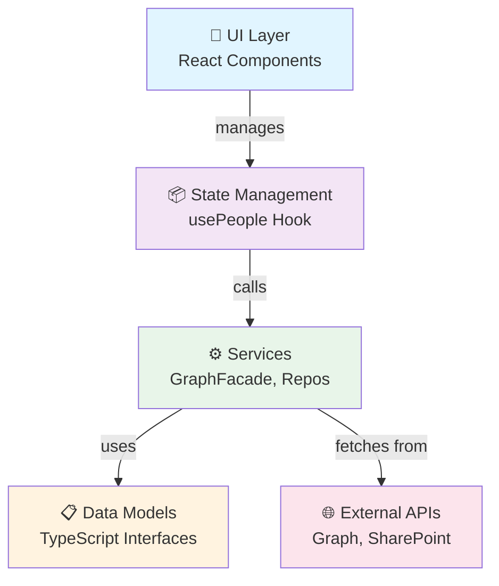

# SkillSearch WebPart – Umfassende Architektur-Dokumentation

---

## 📊 7 Architektur-Diagramme

### 1. **Use Case Diagram**
Zeigt die Benutzer-Interaktionen und Geschäftsfälle:
- **Actors**: Employee User, Admin
- **Use Cases**:
  - 🔍 Search Skills
  - ⚙️ Filter by Department/Level
  - 👁️ View Person Profile
  - ⬇️ Download CV
  - 📄 Generate CV from Template
  - 💬 Contact via Teams/Outlook
  - 🏠 View My Profile
  - 💡 View My Skills

---

### 2. **Activity Diagram**
Sequenzen von Benutzer-Aktivitäten und Systemabläufe:
1. **Initialization Phase**: Load Me + First Page + Prefetch
2. **Search Phase**: Tokenize Query → Text Search → Results
3. **Filter Phase**: Apply Department & Skill Level Filters
4. **Browse Phase**: Infinite Scroll with Pagination
5. **Detail Phase**: Click Person → View Skills → Download CV
6. **CV Generation Phase**: Template Render or Fallback Builder

---

### 3. **Component Diagram**
System-Architektur mit 7 Schichten:
- **UI Layer**: React Components (SkillSearch, PersonCard, SearchBar, FilterMenu, etc.)
- **State Management**: usePeople Custom Hook (Progressive Loading)
- **Service Layer**: GraphFacade, Repositories (Users, Photos, ProfileRepo), Services (Skills, Me, CV)
- **CV Generation**: Adapter (Extract), Template Method, Builder, Parsers (Strategy)
- **Utility Functions**: Search, Filter, Skill Utils, Chunking
- **Data Models**: TypeScript Interfaces (Skill, Person, Me, PeopleResult, ProfileData)
- **External APIs**: Microsoft Graph, SharePoint REST API

---

### 4. **Class Diagram**
Domain-Modelle und Service-Klassen:

**Data Models:**
- `Skill`: { displayName, proficiency? }
- `Person`: { id, displayName, jobTitle?, department?, mail?, userPrincipalName, photoUrl?, skills[] }
- `Me extends Person`: { aboutMe?, responsibilities? }
- `PeopleResult`: { items[], nextLink? }
- `ProfileFile`: { fileUrl, folderUrl, libRootUrl }
- `ProfileData`: { firstName?, lastName?, name?, email?, role?, team?, summary?, projects?, skills?, skillGroups?, languages?, berufserfahrung?, profilnummer? }
- `ProjectItem`: { period?, company?, headline?, description?, bullets?, responsibilitiesTitle? }
- `SkillGroup`: { category, items[] }

**Service Classes:**
- `GraphFacade` (Orchestrator): Composes UsersRepository, SkillsService, MeService
- `UsersRepository`: Query Active Users from Graph, Fallback to /me/people
- `SkillsService`: Enrich users with v1.0 + beta skills (dual-source merge)
- `MeService`: Load current user with profile + skills
- `PhotoService`: Static methods for photo URLs or initials avatar
- `ProfileRepo`: SharePoint file/folder access with caching

---

### 5. **Entity Relationship Model (ERM)**
Logische Datenstruktur:

**Entities:**
- **PERSON**: id (PK), displayName, userPrincipalName (UK), jobTitle, department, mail, aboutMe, responsibilities, photoUrl, created, modified
- **SKILL**: id (PK), personId (FK), displayName, proficiency, rank (1-5), source, created
- **PROJECT**: id (PK), personId (FK), period, company, headline, description, bullets, responsibilitiesTitle, created
- **LANGUAGE**: id (PK), personId (FK), name, proficiency, created
- **DEPARTMENT**: id (PK), name (UK), description, created
- **SKILL_LEVEL**: rank (PK, 1-5), label, description
- **PROFILE_TEMPLATE**: id (PK), templateUrl, templateName, description, lastModified, isActive
- **PROFILE_DATA**: id (PK), personId (FK), templateId (FK), jsonContent, generated, isLatest, docxUrl

**Relationships:**
- PERSON 1:N SKILL
- PERSON 1:N PROJECT
- PERSON 1:N LANGUAGE
- PERSON N:1 DEPARTMENT
- SKILL N:1 SKILL_LEVEL
- PERSON 1:N PROFILE_DATA
- PROFILE_TEMPLATE 1:N PROFILE_DATA

---

### 6. **Deployment Diagram**
Infrastructure & Runtime-Umgebung:

**Deployment Topology:**
```
Developer Machine
  ↓ (TypeScript, Gulp, npm, Webpack)
  ↓ (Compile & Build)
  ↓
CDN / SharePoint App Catalog
  ↓ (JavaScript Bundle, Manifest, CSS)
  ↓ (Distribute)
  ↓
User's Browser (React Runtime)
  ↓ (SPFx Runtime: WebPart Host)
  ↓
SPFx Context (msGraphClientFactory, spHttpClient, pageContext)
  ↓ (Authenticate & Call APIs)
  ↓
Microsoft 365 Environment:
  ├─ Microsoft Graph API (v1.0 + beta)
  │  └─ Azure AD / Entra ID
  ├─ SharePoint Online
  │  └─ Document Library (Beraterprofile)
  ├─ Microsoft Teams
  │  └─ Chat Integration
  └─ Outlook
     └─ Calendar Integration
```

**Hosting:**
- **Deployment Target**: Microsoft 365 Tenant
- **WebPart Hosts**: SharePoint Modern, SharePoint Classic, Teams Tab, Outlook
- **Static Assets**: SharePoint App Catalog or external CDN
- **Runtime**: React 17 in Browser (SPFx Framework manages lifecycle)

---

### 7. **Tabellenmodell (Data Schema - SQL)**

#### **PERSON Table**
```sql
CREATE TABLE PERSON (
  id                 UUID PRIMARY KEY,
  displayName        VARCHAR(255) NOT NULL,
  userPrincipalName  VARCHAR(255) NOT NULL UNIQUE,
  jobTitle           VARCHAR(255),
  department         VARCHAR(255),
  mail               VARCHAR(255),
  aboutMe            TEXT,
  responsibilities   JSON,  -- Array of strings
  photoUrl           VARCHAR(512),
  departmentId       UUID,  -- FK to DEPARTMENT
  created            TIMESTAMP DEFAULT CURRENT_TIMESTAMP,
  modified           TIMESTAMP DEFAULT CURRENT_TIMESTAMP ON UPDATE CURRENT_TIMESTAMP,
  
  FOREIGN KEY (departmentId) REFERENCES DEPARTMENT(id),
  INDEX idx_upn (userPrincipalName),
  INDEX idx_dept (departmentId),
  INDEX idx_displayName (displayName)
);
```

#### **SKILL Table**
```sql
CREATE TABLE SKILL (
  id          UUID PRIMARY KEY,
  personId    UUID NOT NULL,
  displayName VARCHAR(255) NOT NULL,
  proficiency VARCHAR(50),  -- e.g., "Expert", "Advanced", "Associate", "Foundation", "Beginner"
  rank        INTEGER CHECK (rank BETWEEN 1 AND 5),
  source      ENUM('v1', 'beta') DEFAULT 'v1',
  created     TIMESTAMP DEFAULT CURRENT_TIMESTAMP,
  
  FOREIGN KEY (personId) REFERENCES PERSON(id) ON DELETE CASCADE,
  INDEX idx_person (personId),
  INDEX idx_rank (rank),
  UNIQUE KEY (personId, displayName)
);
```

#### **PROJECT Table**
```sql
CREATE TABLE PROJECT (
  id                    UUID PRIMARY KEY,
  personId              UUID NOT NULL,
  period                VARCHAR(100),  -- e.g., "Jan 2020 - Dec 2021"
  company               VARCHAR(255),
  headline              VARCHAR(255),
  description           TEXT,
  bullets               JSON,  -- Array of strings (up to 10 bullets)
  responsibilitiesTitle VARCHAR(100) DEFAULT 'Verantwortlichkeiten:',
  created               TIMESTAMP DEFAULT CURRENT_TIMESTAMP,
  
  FOREIGN KEY (personId) REFERENCES PERSON(id) ON DELETE CASCADE,
  INDEX idx_person (personId)
);
```

#### **LANGUAGE Table**
```sql
CREATE TABLE LANGUAGE (
  id          UUID PRIMARY KEY,
  personId    UUID NOT NULL,
  name        VARCHAR(50),  -- e.g., "German", "English", "French"
  proficiency VARCHAR(50),  -- e.g., "Native", "Fluent", "Professional", "Basic"
  created     TIMESTAMP DEFAULT CURRENT_TIMESTAMP,
  
  FOREIGN KEY (personId) REFERENCES PERSON(id) ON DELETE CASCADE,
  INDEX idx_person (personId),
  UNIQUE KEY (personId, name)
);
```

#### **DEPARTMENT Table**
```sql
CREATE TABLE DEPARTMENT (
  id          UUID PRIMARY KEY,
  name        VARCHAR(255) NOT NULL UNIQUE,
  description TEXT,
  created     TIMESTAMP DEFAULT CURRENT_TIMESTAMP,
  
  INDEX idx_name (name)
);
```

#### **SKILL_LEVEL Table**
```sql
CREATE TABLE SKILL_LEVEL (
  rank        INTEGER PRIMARY KEY CHECK (rank BETWEEN 1 AND 5),
  label       VARCHAR(50) NOT NULL,  -- e.g., "Expert", "Advanced"
  description TEXT
);

-- Seed data
INSERT INTO SKILL_LEVEL (rank, label, description) VALUES
(1, 'Beginner', 'Just starting out'),
(2, 'Foundation', 'Basic knowledge'),
(3, 'Associate', 'Intermediate level'),
(4, 'Advanced', 'Senior level'),
(5, 'Expert', 'Principal/Architect level');
```

#### **PROFILE_TEMPLATE Table**
```sql
CREATE TABLE PROFILE_TEMPLATE (
  id            UUID PRIMARY KEY,
  templateName  VARCHAR(255) NOT NULL,
  templateUrl   VARCHAR(512),  -- URL to DOCX in SharePoint
  description   TEXT,
  lastModified  TIMESTAMP DEFAULT CURRENT_TIMESTAMP ON UPDATE CURRENT_TIMESTAMP,
  isActive      BOOLEAN DEFAULT TRUE,
  
  INDEX idx_active (isActive)
);
```

#### **PROFILE_DATA Table**
```sql
CREATE TABLE PROFILE_DATA (
  id           UUID PRIMARY KEY,
  personId     UUID NOT NULL,
  templateId   UUID,  -- FK to PROFILE_TEMPLATE
  jsonContent  LONGTEXT,  -- Full ProfileData as JSON
  generated    TIMESTAMP DEFAULT CURRENT_TIMESTAMP,
  isLatest     BOOLEAN DEFAULT TRUE,
  docxUrl      VARCHAR(512),  -- URL to generated DOCX
  
  FOREIGN KEY (personId) REFERENCES PERSON(id) ON DELETE CASCADE,
  FOREIGN KEY (templateId) REFERENCES PROFILE_TEMPLATE(id),
  INDEX idx_person (personId),
  INDEX idx_latest (isLatest),
  INDEX idx_generated (generated)
);
```

---

## 📋 Tabellenbeziehungen – SQL Joins

### **Get all skills for a person:**
```sql
SELECT p.displayName, s.displayName, s.proficiency, sl.label
FROM PERSON p
JOIN SKILL s ON p.id = s.personId
JOIN SKILL_LEVEL sl ON s.rank = sl.rank
WHERE p.id = 'person-uuid'
ORDER BY s.rank DESC;
```

### **Get people by department:**
```sql
SELECT p.* 
FROM PERSON p
JOIN DEPARTMENT d ON p.departmentId = d.id
WHERE d.name = 'Engineering'
ORDER BY p.displayName;
```

### **Get latest profile data for a person:**
```sql
SELECT pd.id, pd.jsonContent, pt.templateName, pd.generated
FROM PROFILE_DATA pd
LEFT JOIN PROFILE_TEMPLATE pt ON pd.templateId = pt.id
WHERE pd.personId = 'person-uuid' AND pd.isLatest = TRUE;
```

---

## 🔑 Key Indices für Performance

| Table | Index | Columns | Purpose |
|-------|-------|---------|---------|
| PERSON | `idx_upn` | userPrincipalName | Fast user lookup |
| PERSON | `idx_displayName` | displayName | Search by name |
| PERSON | `idx_dept` | departmentId | Filter by department |
| SKILL | `idx_person` | personId | Get skills for user |
| SKILL | `idx_rank` | rank | Filter by skill level |
| SKILL | `(personId, displayName)` | Composite | Prevent duplicates |
| PROJECT | `idx_person` | personId | Get projects for user |
| LANGUAGE | `idx_person` | personId | Get languages for user |
| DEPARTMENT | `idx_name` | name | Lookup department |
| PROFILE_DATA | `idx_person` | personId | Get profiles for user |
| PROFILE_DATA | `idx_latest` | isLatest | Get current profile |
| PROFILE_DATA | `idx_generated` | generated | Timeline queries |

---

## 📐 Normalisierung & Designprinzipien

- **3NF (Third Normal Form)**: Alle Tabellen sind normalisiert
- **Foreign Keys**: CASCADE DELETE für abhängige Daten
- **Unique Constraints**: Verhindert Duplikate (z.B. userPrincipalName, department name)
- **Timestamps**: created, modified für Auditing
- **JSON Columns**: Flexible Arrays (responsibilities, bullets, jsonContent)
- **Composite Keys**: (personId, displayName) für Skill-Eindeutigkeit

---

## 🏗️ Architektur-Zusammenfassung

| Ebene | Komponenten | Technologie |
|-------|-------------|-------------|
| **Presentation** | SkillSearch.tsx, PersonCard, SearchBar, FilterMenu | React 17 |
| **State Mgmt** | usePeople Hook | React Hooks |
| **Business Logic** | GraphFacade, UsersRepository, SkillsService, MeService | TypeScript Classes |
| **Data Access** | ProfileRepo | REST API (SharePoint, Graph) |
| **CV Generation** | Adapter, Template Method, Builder, Parsers | Docxtemplater, Mammoth |
| **Utilities** | Search (tokenize), Filter (rank), Chunk | Pure Functions |
| **Data Models** | Skill, Person, Me, ProfileData, ProjectItem | TypeScript Interfaces |
| **External APIs** | Microsoft Graph v1.0 & beta, SharePoint REST | REST + OAuth 2.0 |
| **Hosting** | SharePoint App Catalog | SPFx + Microsoft 365 |

---

## 🎯 Design Patterns Übersicht

| Pattern | Klasse | Zweck |
|---------|--------|-------|
| **Facade** | GraphFacade | Orchestriert Repos + Services |
| **Repository** | UsersRepository, ProfileRepo | Datenquellen abstrahieren |
| **Service** | SkillsService, MeService, PhotoService | Geschäftslogik |
Yes, you can visualize the diagrams using Mermaid! Here's the rewritten content for the Design Patterns table that includes a Mermaid diagram:

| **Custom Hook** | usePeople | React State + Async Logic |
| **Builder** | dataportFallback | DOCX Generation Fallback |

---

## 📊 Mermaid Diagram: Architecture Overview



| **Template Method** | fillDataportTemplate | DOCX-Pipeline |
| **Strategy** | parsers/* | Parse-Strategien (Skill, Project, Language) |
| **Adapter** | extractProfileDataFromDocx | DOCX → ProfileData |
| **Module Caching** | profileRepo.ts | In-flight De-duplication |
| **Pure Functions** | search.ts, filters.ts | Filterung & Suche |
| **Lazy Loading** | usePeople prefetch | Progressive UI Loading |
| **Dependency Injection** | GraphFacade, usePeople | Loose Coupling |
| **Composition** | GraphFacade | über Vererbung |

---

## 📁 Projektstruktur (Komplettübersicht)

```
src/webparts/SkillSearch/
├── SkillSearchWebPart.ts              # SPFx Entry Point
├── SkillSearch.tsx                    # Main React Component
├── SkillSearchWebPart.manifest.json   # Web Part Metadata
├── services/
│   ├── graph.ts                      # GraphFacade
│   ├── users.ts                      # UsersRepository
│   ├── skillService.ts               # SkillsService
│   ├── meService.ts                  # MeService
│   ├── PhotoService.ts               # PhotoService
│   ├── profileRepo.ts                # ProfileRepo + Caching
│   ├── models.ts                     # DTOs
│   ├── constants.ts                  # Constants
│   ├── utils.ts                      # Utility Functions
│   ├── index.ts                      # Exports
│   └── cvGenerate/
│       ├── index.ts                  # Facade
│       ├── types.ts                  # ProfileData, ProjectItem
│       ├── profileExtractor.ts       # Adapter
│       ├── download.ts               # Download utilities
│       ├── docx/
│       │   ├── templateRenderer.ts   # Template Method
│       │   ├── dataportFallback.ts   # Builder Pattern
│       │   ├── photoHandling.ts      # Image Processing
│       │   ├── templateDetection.ts  # Detection Logic
│       │   └── textExtraction.ts     # Text Utilities
│       └── parsers/
│           ├── skillParser.ts        # Strategy: Parse Skills
│           ├── projectParser.ts      # Strategy: Parse Projects
│           ├── experienceParser.ts   # Strategy: Compute Experience
│           ├── languageParser.ts     # Strategy: Parse Languages
│           └── listHelpers.ts        # Helper Functions
├── ui/
│   ├── components/
│   │   ├── SkillSearch.tsx          # Main UI Component
│   │   ├── PersonCard.tsx           # Result Item
│   │   ├── SearchBar.tsx            # Input Field
│   │   ├── FilterMenu.tsx           # Filter UI
│   │   ├── HeroMeCard.tsx           # User Hero Section
│   │   ├── SkillsModal.tsx          # Skills Modal
│   │   ├── ProfileActions.tsx       # Action Buttons
│   │   └── ISkillSearchProps.ts     # Props Interface
│   ├── hooks/
│   │   └── usePeople.ts             # Custom Hook
│   └── *.module.scss                # CSS Modules
├── utils/
│   ├── search.tsx                   # Search Logic
│   ├── filters.ts                   # Filter Logic
│   └── skills.ts                    # Skill Utils
├── types/
│   └── global.d.ts                  # Global Types
└── loc/
    ├── en-us.js                     # i18n Strings
    └── mystrings.d.ts               # i18n Types
```

---

## 🚀 Build & Deployment

**Build Process:**
1. TypeScript → JavaScript (Webpack)
2. SCSS → CSS (Gulp)
3. Bundle → lib/webparts/SkillSearch.js
4. Generate manifest → SkillSearch.manifest.json
5. Package → .sppkg (SharePoint Package)

**Deployment:**
1. Upload .sppkg to SharePoint App Catalog
2. Approve API permissions (Microsoft Graph scopes)
3. Enable WebPart on modern pages / Teams / Outlook

---

End of Documentation. Alle 7 Diagramme und Schemas.
